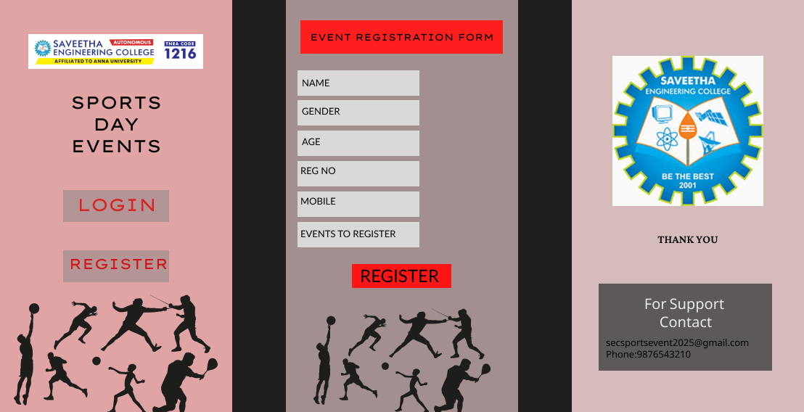

# Ex09 Event Registration Web Application
## Date: 26/12/2025

## AIM:
To design, develop and deploy a web application for event registration.

## DESIGN STEPS:

### Step 1:
Create a new frame.

### Step 2:
Select any one preset size of your choice.

### Step 3:
Select the shapes you need.

### Step 4:
Import images as needed.

### Step 5:
Create pages based on your need and link them.

### Step 6:

Validate the HTML and CSS code.

### Step 6:

Publish the website in the given URL.

## DESIGN TOOL:
Figma

## CODE:
Layer 1 
```
<!DOCTYPE html>
<html>
  <head>
    <meta name="viewport" content="width=device-width, initial-scale=1" />
    <meta charset="utf-8" />
    <link rel="stylesheet" href="globals.css" />
    <link rel="stylesheet" href="style.css" />
  </head>
  <body>
    <div class="iphone-SE">
      <div class="rectangle"></div>
      <div class="div"></div>
      
      <div class="text-wrapper">SPORTS DAY EVENTS</div>
      <div class="text-wrapper-2">LOGIN</div>
      <div class="text-wrapper-3">REGISTER</div>
      
    </div>
  </body>
</html>
```

Layer 2
```
<!DOCTYPE html>
<html>
  <head>
    <meta name="viewport" content="width=device-width, initial-scale=1" />
    <meta charset="utf-8" />
    <link rel="stylesheet" href="globals.css" />
    <link rel="stylesheet" href="style.css" />
  </head>
  <body>
    <div class="iphone-SE">
      <div class="rectangle"></div>
      <div class="text-wrapper">EVENT REGISTRATION FORM</div>
      
      <div class="div"></div>
      <div class="rectangle-2"></div>
      <div class="rectangle-3"></div>
      <div class="rectangle-4"></div>
      <div class="rectangle-5"></div>
      <div class="rectangle-6"></div>
      <div class="rectangle-7"></div>
      <div class="text-wrapper-2">NAME</div>
      <div class="text-wrapper-3">GENDER</div>
      <div class="text-wrapper-4">AGE</div>
      <div class="text-wrapper-5">REG NO</div>
      <div class="text-wrapper-6">MOBILE</div>
      <div class="text-wrapper-7">EVENTS TO REGISTER</div>
      <div class="text-wrapper-8">REGISTER</div>
    </div>
  </body>
</html>
```

Layer 3
```
<!DOCTYPE html>
<html>
  <head>
    <meta name="viewport" content="width=device-width, initial-scale=1" />
    <meta charset="utf-8" />
    <link rel="stylesheet" href="globals.css" />
    <link rel="stylesheet" href="style.css" />
  </head>
  <body>
    <div class="iphone-SE">
      
      <div class="THANK-YOU">THANK YOU</div>
      <div class="rectangle"></div>
      <div class="for-support-contact">For Support <br />Contact</div>
      <div class="div"></div>
      <div class="secsportsevent">secsportsevent2025@gmail.com<br />Phone:9876543210</div>
    </div>
  </body>
</html>
```

## OUTPUT:


Page 1
.png>)

Page 2
.png>)

Page 3
.png>)

## RESULT:
The program to design, develop and deploy a web application for event registration is completed successfully.
